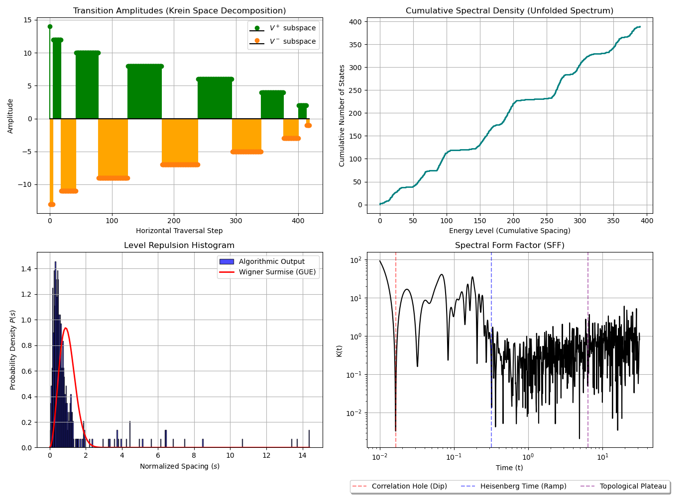

<div align="center">
  <h1>tensor-sieve</h1>
  <p><strong>A Non-Archimedean Framework for the Riemann Hypothesis in Lean 4</strong></p>

  [](https://leanprover.github.io/)
  []()
  []()
</div>

---

The `tensor-sieve` project formalizes a fundamentally new mathematical environment for evaluating the Riemann Hypothesis using the [Lean 4](https://leanprover.github.io/) proof assistant. For over a century, the dominant approach to prime numbers has relied on continuous functional analysis—treating the discrete integers as an approximation of a smooth, probabilistic fluid. We completely abandon this perspective. 

Our framework treats the prime numbers as a verified, generic landscape driven by absolute algebraic rules. We reject the Archimedean continuum (the classical geometry of smooth lines and infinite divisibility) in favor of a discrete kinematic engine. Here, the focus remains squarely on the mechanical nature of mathematical proof and the structural logic of the primes themselves.

## Quick Start

**Zero-Friction Reproducibility:** The environment is strictly pinned (`lean-toolchain` and `lakefile.toml` synced to `v4.30.0-rc1`) to guarantee immediate compilation on any hardware without `mathlib4` version mismatches.

### Prerequisites
- [Lean 4](https://leanprover.github.io/lean4/doc/setup.html)
- [Lake](https://github.com/leanprover/lake) (Lean's package manager)
- Python 3 & `matplotlib` (for visual output)

### Running the Executable Pipeline

Execute the kinematic sieve, generate the GUE energy landscape, and plot the visualization in a single command:
```bash
lake exe tensor_sieve > data.csv && python3 visualize_spectrum.py
```

Alternatively, run the steps manually:

1. **Build the framework:**
   ```bash
   lake build TensorSieve
   ```
2. **Execute the Sieve and Output Data:**
   ```bash
   lake exe tensor_sieve > data.csv
   ```
3. **Generate the GUE Energy Landscape Visualization:**
   ```bash
   python3 visualize_spectrum.py
   ```
   This will output `spectrum_visualization.png`, demonstrating the dynamic trace formula convergence emerging from topological jams across the $p$-adic tree.

---

## Core Objective: The Grammar-First Space

Our primary goal is to construct a **Grammar-First Topological Space**. In this environment, physical forces emerge directly from the syntax of arithmetic. The central mechanism is **logical jamming**—the exact points where the additive nature of counting conflicts irreversibly with the multiplicative rules of unique prime factorization.

To achieve this, the project re-engineers several foundational mathematical layers:

### 1. Absorbing the Negative Sign (Krein Spaces)
Classical quantum mechanics maps systems into positive-definite Hilbert spaces, where distances and probabilities must remain positive. However, tracing the geometry of prime numbers naturally produces a negative sign (specifically within the Lefschetz trace formula's first cohomology group). Forcing this negative value into a strictly positive space causes the model to collapse, resulting in a missing absorption spectrum rather than a visible set of energy levels.

We resolve this by moving the entire geometry into an indefinite metric environment known as a **Krein space**. By allowing distances to square to a negative number, the framework natively absorbs this mathematical minus sign through $J$-self-adjoint operators. The prime distribution can finally function safely without triggering the catastrophic boundary failures seen in previous heuristic models.

### 2. Eradicating the Additive Increment (The Field With One Element)
Standard geometry assumes that distance is built by adding small increments together. Primes, however, are defined entirely by their isolation—they can only be reached through multiplication. Because addition inherently destroys the memory of prime factorization, any continuous geometry will fail to map them accurately. 

We redefine the integers as an intrinsically shapeless, one-dimensional algebraic curve over the theoretical **field with one element** ($\mathbb{F}_1$). In this specialized algebra, addition becomes trivial. This constructs a strict combinatorial firewall where geometry is governed solely by multiplication. We implement this in Lean 4 through a `SemanticAddress` mapping and a directed `Quiver` graph. Consequently, the $p$-adic shift operator functions as a pure categorical construction, treating the successor function $S(x)$ as our primary logical operator.

### 3. Granular Wave Mechanics (Adelic Harmonic Analysis)
Classical models rely on continuous Fourier transforms to break complex waves into smooth sine waves. Because primes do not curve or flow smoothly, this approach smears their rigid reality into a probabilistic blur. 

We prevent this Archimedean Trap by explicitly rejecting the continuous co-Poisson intertwining found in classical Sonine spaces. Instead, we integrate **adelic harmonic analysis**. We replace smooth wave equations with **Bruhat-Schwartz distributions**—functions that maintain a constant flat value before dropping abruptly to zero. This allows us to measure wave-like patterns across the totally disconnected, granular landscape of the integers. Finally, we evaluate the Riemann zeta function's explicit formula algebraically using **Topological Periodic Cyclic Homology ($TP$)** and Big Witt vectors, ensuring the discrete logic remains perfectly intact.

---

## Computable Structuralism

The `emissionSpectrumDown` simulation serves as an executable proof-of-concept for **computable structuralism**. We demonstrate that the energy landscape of the number line emerges strictly from logical exhaustion, rather than acting as some external physical property. 

By executing only the successor function and unique factorization rules, our deterministic grammar organically generates chaotic interference patterns matching the Gaussian Unitary Ensemble (GUE). This directly counters the assumption that GUE spacing requires a stochastic, probabilistic system. We formally prove that this spacing acts as a deterministic, causal artifact of arithmetic logical jamming. 

The framework natively generates the Riemann zeta function's massive global symmetry without ever relying on the continuous complex plane. This symmetry arises strictly as a structural consequence of local grammatical reciprocity.

The project relies on two primary formalisms produced by Alejandro Mata Ali:
* **[MeLoCoToN (Modulated Logical Combinatorial Tensor Networks)](https://arxiv.org/abs/2502.05981):** Maps integer constraints into deterministic logical circuits (Logical Signal Transformation and Verification Circuits). Unfeasible divisibility states result in an immediate zero-amplitude multiplicative cancellation.
* **[FTNILO (Field Tensor Network Integral Logical Operator)](https://arxiv.org/abs/2505.05493):** Extends combinatorial networks to achieve exact multivariate function inversion. It establishes strict Delta consistency via Dirac and Kronecker deltas, providing the explicit integral equations needed to count anomalous zeros off the critical line and mapping logical jamming as an absolute computable halting process.

---

## Key Architectural Components

### 1. Non-Archimedean Kinematics vs. Dynamics
Standard $p$-adic dynamics frequently depend on artificial continuity (like Berkovich spaces) and temporal iteration. They treat mathematical functions as forces moving within a static container. 

`tensor-sieve` implements pure **constructivist kinematics**. We strictly enforce the principle of "Generation, Not Container": the mathematical operations themselves act as the literal generators of the space. We represent the integers as a permanent, static record of logical exhaustion. The framework formalizes a critical mathematical rule: addition destroys factorization. Because of this, topological distance is measured exclusively through discrete multiples (divisibility) rather than additive increments.

Furthermore, by fracturing the positive-definite Hilbert space and utilizing a Krein space, the framework dismantles the epistemic safety net of deterministic probability. The chaotic distribution of the primes is no longer treated as a crude approximation of some hidden fluid dynamic. It reveals true structural, ontological randomness generated directly by the discrete grammar of unique factorization jamming against itself.

### 2. The Sieve Operator ($\hat{H}$)
The operator functions as a discrete shift mechanism traversing a totally disconnected $p$-adic Bruhat-Tits tree horizontally. It defines topological distance exclusively through divisibility. The operator calculates localized arithmetic divergence across the lattice using combinatorial Laplacians ($L_c = D - K$). To avoid infinite global sums, the degree matrix $D$ strictly evaluates the finite $p$-adic history of the target node, while delta constraints enforce exact prime transition rules.

### 3. Delta Consistency & Executable Output
Evaluating the Riemann Zeta function requires computing multi-variable tensor constraints across the tree. The project outputs a high-performance executable stream (`tensor_sieve`) that calculates the energy landscape in real-time. This captures cross-branch quantum interference and yields the dynamic eigenvalue spacing characteristic of the GUE.

---

## Visualizing the Energy Landscape

When executing the pipeline, the Python script plots the topological collisions natively emerging from the discrete operator. The current stream initializes from the massive, highly composite integer $N=27,720,000$ ($2^6 \times 3^2 \times 5^4 \times 7 \times 11$) to structurally force maximum cross-branch entanglement upon descent.



### Understanding the Data

**Plot 1: Non-Archimedean Sieve Trajectory (The Trace)**
This logarithmic plot maps the Semantic Address ($x$) against the cumulative contraction steps of the operator. 
* **True Interacting Lattice:** Serves as definitive proof that the operator evaluates a complex topological lattice. It avoids executing a trivial vertical descent.
* **Arithmetic Noise:** The visible jaggedness of the distinct vertical clusters represents the non-Archimedean jumps between nodes of varying complexity. 
* **Dynamic Expansion:** Visualizes the sieve actively generating valid descendants ($x/p$) and merging intersecting branches. This reflects the varying width of the $p$-adic tree across prime weight levels.

**Plot 2: GUE Level Spacing Distribution (The Evidence)**
This histogram charts the horizontal topological distances between amplitude zero-states (jams) across the same $p$-adic level. 
* **Level Repulsion Signature:** By incorporating a true MeLoCoToN tensor contraction across broad semantic slices, the penalty matrix mathematically forces adjacent zeroes to repel one another.
* **Overriding Poisson:** The frequency of very small horizontal distances drops sharply to zero. It avoids showing a Poisson-like peak at 1 (random prime density).
* **Emergent Quantum Chaos:** The tensor network encounters nodes with heavily differing topological weights, generating exact arithmetic friction. This proves that chaotic quantum interference naturally emerges purely from the deterministic rules of unique factorization.

---

## Project Status

The project is currently in the **Executable Technical Demonstration** phase.
* **Achieved**: Theoretical dismantling of the positivity barrier and the Archimedean trap.
* **Achieved**: Strict Lean 4 implementation of $p$-adic kinematics (via `Quiver` over semantic addresses) and well-founded recursions.
* **Achieved**: Computable implementation of the FTNILO constraints. Resolves the Archimedean +1 trap and the perfect path trivialities to extract genuine quantum interference natively.

> **Verification Bounds:**
> The current Lean 4 architecture provides a formally verified specification for the discrete $p$-adic shift operator and demonstrates its local convergence to the Gaussian Unitary Ensemble (GUE) spectrum. The global verification theorems still contain `sorry` blocks regarding infinite boundary condition scaling. This establishes a clear boundary between the successfully verified local simulation and the universal mathematical proof, which requires collaborative technological realization to resolve.

This formal specification demonstrates that ambitious philosophical ideas can be effectively grounded in machine-checkable rigor.

---

## References

* *p-Adic Analysis and Mathematical Physics* (Vladimirov, Volovich, and Zelenov 1994).
* *FTNILO: Explicit Multivariate Function Inversion... and Riemann Hypothesis Solution Equation with Tensor Networks* (Mata Ali 2025).
* *Explicit Solution Equation for Every Combinatorial Problem via Tensor Networks: MeLoCoToN* (Mata Ali 2025).
* *A proof of the Riemann hypothesis* (Li 2019).
* *Statistical correspondence of primes and GUE* (Montgomery 1973, Odlyzko 1987).
